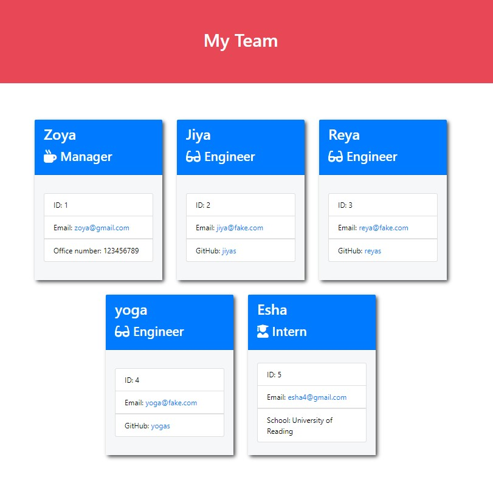

# Module 12 Object-Oriented Programming: Team Profile Generator

## Description

This app generates a team profile using the Inquirer module from Node.js and displays the information on a newly created HTML page. This app focused on OOP and TDD using jest.

## User Story

As a manager a user want to generate a webpage that displays my team's basic info so that a user have quick access to their emails and GitHub profiles.

## Table of Contents 

Description
User Story
Acceptance Criteria
Mock-Up
Installation
Usage
License
Contributing
Tests
FAQs

## Installation

Use your terminal to clone or download or copy the zip file to a directory of your choice. Then open the file in VS Code or whatever editor you use. In VS Code, open the terminal and navigate to Team Profile Generator in the root directory. Now you can run the application!

##  Usage
Launch the terminal by typing 'node index' after the installation is complete. After answering the prompts, you should see a console log showing your answers, a message that says ‘Team Proflies created success!’, and you should see your file called ‘index.html’ flie in src folder.

## License

Your repository is licensed under an mit open source license, so other people can contribute more easily.

## Contributing
We are open to all kinds of contributions. If you want to:

Suggest a feature
Report an issue
Improve documentation
Contribute to the code

We are excited that you are reading this and are willing to contribute. No need to think big. Even a typo fix might save our day and make you a hero. Every contribution counts!

## Tests
Open this file in VS Code to test it. Using the terminal, open the Team Profile Generator folder and run the 'npm run test' command. You can view a preview of the test this application.

## Home page for my Team Profile Generator.

## Please contact me using the following links:

Email: priyasatish1626@gmail.com
Github: https://github.com/priyadarsini-gunasekaran 